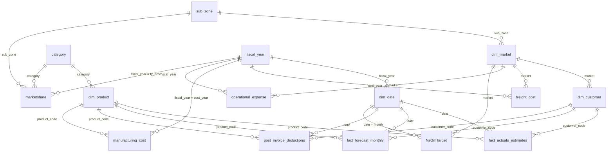

# Approach: How I Built AtliQ Business 360

> **Project:** AtliQ Business Compass 360 (Power BI) · **Type:** Guided project (Codebasics)
> **Stack:** MySQL · Power Query (M) · Power BI data model · DAX · Excel/flat files for manual inputs

This document explains **what I did, why I chose it, and what trade-offs it carries**.

---

## 1. Approach in one view

```text
Business questions (Finance, Sales, Marketing, Supply Chain, Executive)
        ↓
Data extraction: MySQL (gdb041) + curated flat files
        ↓
Power Query: fiscal calendar, append actuals + forecast, merge price / deductions / costs / OpEx
        ↓
Star-schema model: 3 fact tables + dimensions + shared lookup tables
        ↓
DAX: layered measures (base → derived → time intelligence → benchmark switch → P&L engine)
        ↓
Report pages: Home · Finance · Sales · Marketing · Supply Chain · Executive · Info 
        ↓
Validation → insights → recommendations
```

---

## 2. Data sources

| Table | Source | Role |
|---|---|---|
| `dim_customer`, `dim_market`, `dim_product` | MySQL (`gdb041`) | Dimensions |
| `fact_sales_monthly`, `fact_forecast_monthly` | MySQL (`gdb041`) | Monthly sales actuals and forecast quantities |
| `gross_price`, `pre_invoice_deductions`, `post_invoice_deductions`, `manufacturing_cost`, `freight_cost` | System data (MySQL) | Price, discount and cost inputs |
| `NsGmTarget` | Curated flat file (manual) | Monthly Net Sales, Gross Margin and Net Profit targets by market (**FY2022 only**) |
| `operational_expense` | Curated flat file (manual) | Ads & promotions % and other OpEx % by market and fiscal year |
| `marketshare` | Curated flat file (manual) | Manufacturer sales by sub-zone, category and year |
| `dim_date`, `report_refresh_date`, `last_sales_month` | Built in Power Query | Calendar, refresh timestamp, data cut-off |
| `P&L Rows`, `P&L Columns`, `SetBM`, `Target Gap Tolerance`, `Key Measures` | Built in Power BI | Report-logic helpers and the measure table |

Connection pattern for the MySQL tables:

```m
MySQL.Database("127.0.0.1:3306", "gdb041", [ReturnSingleDatabase = true])
```

---

## 3. Power Query decisions

| Decision | What I did | Why |
|---|---|---|
| **Fiscal calendar** | Built `dim_date` from Sep 2017 to Aug 2022 (`{Number.From(#date(2017,9,1))..Number.From(#date(2022,8,1))}`), added `Start of Month`, and defined `fiscal_year = Date.Year(Date.AddMonths([Start of Month], 4))`. | AtliQ's fiscal year starts in **September**. Adding 4 months moves Sep–Dec into the next calendar year, so Sep 2021 → FY2022. |
| **One continuous fact table** | `Table.Combine({fact_sales_monthly, remaining_forecast})` to create `fact_actuals_estimates`. | A single timeline of actual months followed by estimated months, so one set of measures serves both. |
| **Dynamic cut-off** | `last_sales_month = List.Max(fact_sales_monthly[date])` | Actual-vs-estimate logic follows the data instead of a hard-coded date. Here it is Dec 2021. |
| **Enrich the fact table at row level** | Left-outer merged `gross_price` on `(product_code, fiscal_year)` and `pre_invoice_deductions` on `(customer_code, fiscal_year)`, then computed `gross_price_amount = Qty × gross_price` and `net_invoice_sales_amount = gross_price_amount − pre_invoice_discount_amount`. Post-invoice, cost and OpEx amounts follow the same pattern. | Price and discount rates are stored per year. Computing amounts per row keeps DAX to simple `SUM`s and makes measures fast. **Trade-off:** a wider fact table. |
| **Left outer joins** | All enrichment merges use `JoinKind.LeftOuter`. | Keeps every sales row, so a missing rate doesn't silently drop revenue. |
| **Key typing** | `fiscal_year` converted to text before joining; money columns set to `Currency.Type`. | Join keys must match in type, and fixed-decimal currency avoids floating-point drift. |
| **Refresh stamp** | `report_refresh_date = #table(type table[Report Last Refreshed = datetime], {{DateTime.LocalNow()}})` | Lets the report show when data was last loaded. |
| **P&L layout tables** | `P&L Rows` (17 ordered line items) and `P&L Columns` (column headers: fiscal year, `BM`, `Chg`, `Chg %`). | Control the order and columns of the P&L matrix without hard-coding visuals. |
| **Selector tables** | `SetBM` (ID 1 = Last Year, ID 2 = Target) and `Target Gap Tolerance` (set to 5%). | Let the user switch the benchmark and set a tolerance band. |

---

## 4. Data model

### Shape

The model is a **star schema** with two fact tables and shared dimensions. Geography is a short chain (`dim_customer → dim_market → sub_zone`), which is a snowflaked branch. I mention it because it is a common interview question.


## Info View


### Table roles

| Type | Tables |
|---|---|
| **Facts** | `fact_actuals_estimates` (main), `fact_forecast_monthly` |
| **Core dimensions** | `dim_customer`, `dim_product`, `dim_market`, `dim_date` |
| **Shared lookups** | `fiscal_year`, `sub_zone`, `category` |
| **Supporting tables** | `post_invoice_deductions`, `manufacturing_cost`, `freight_cost`, `operational_expense`, `NsGmTarget`, `marketshare` |
| **Helpers** | `Key Measures`, `P&L Rows`, `P&L Columns`, `SetBM`, `Target Gap Tolerance`, `last_sales_month`, `report_refresh_date` |

### Relationships

All 24 relationships are **many-to-one**, with the "one" side on a dimension or lookup table.

| From (many) | To (one) | Key |
|---|---|---|
| `fact_actuals_estimates`, `fact_forecast_monthly`, `post_invoice_deductions` | `dim_customer` | `customer_code` |
| same three tables | `dim_product` | `product_code` |
| same three tables | `dim_date` | `date` |
| `manufacturing_cost` | `dim_product` | `product_code` |
| `dim_customer`, `freight_cost`, `operational_expense`, `NsGmTarget` | `dim_market` | `market` |
| `NsGmTarget` | `dim_date` | `month → date` |
| `dim_market`, `marketshare` | `sub_zone` | `sub_zone` |
| `dim_product`, `marketshare` | `category` | `category` |
| `dim_date`, `freight_cost`, `manufacturing_cost`, `operational_expense`, `marketshare` | `fiscal_year` | `fiscal_year` (`cost_year`, `fy_desc` in the source columns) |

### Why shared lookup tables?

`marketshare`, `operational_expense` and the cost tables sit at different grains from the sales facts: by sub-zone, category or fiscal year, not by customer and product. Shared lookups (`fiscal_year`, `sub_zone`, `category`) let one slicer filter all of them consistently, **without** creating many-to-many relationships.

---

## 5. DAX layer

I built every metric as an **explicit measure** in a dedicated `Key Measures` table, in layers. Names below are shown cleaned up (the model has a few spelling variants).

### Layer 1: P&L chain

```dax
NS $                  = [NIS $] - [Total Post Invoice Deduction $]
GM $                  = [NS $] - [Total COGS $]
Operational Expense $ = ([Ads & Promotions $] + [Other Operational Expense $]) * -1
Net Profit $          = [GM $] + [Operational Expense $]
```

Supporting measures include `GS $`, `NIS $`, `Pre Invoice Deduction $ = GS − NIS`, `Total COGS $` (manufacturing + freight + other), `GM %`, `Net Profit %` and `GM / Unit`.

### Layer 2: time intelligence

Each core measure has a Last Year twin using `SAMEPERIODLASTYEAR(dim_date[date])`, for example `NS $ LY`, `GM % LY`, `Net Profit % LY` and `Forecast Accuracy % LY`.

### Layer 3: benchmark switch (Last Year vs Target)

```dax
NS BM $ =
SWITCH(
    TRUE(),
    SELECTEDVALUE(SetBM[ID]) = 1, [NS $ LY],
    SELECTEDVALUE(SetBM[ID]) = 2, [NS Target $]
)

NS Target $ =
VAR tgt = SUM(NsGmTarget[ns_target])
RETURN IF([Customer / Product Filter Check], BLANK(), tgt)
```

**Design choices**

- Targets exist only at **market × month** grain. `Customer / Product Filter Check` (`ISCROSSFILTERED` / `ISFILTERED`) returns BLANK when the user filters by customer or product, so the report never shows a misleading target.
- `BM Message` displays "BM Target(s) is not available for the selected filters" when targets are missing (all years except FY2022).

### Layer 4: dynamic P&L engine

`P & L Values` is one measure that returns the right line item for each row of the matrix by switching on `P&L Rows[Order]`. It converts dollars to **millions** and ratios to **percentages**. `P & L Final Value` then decides which column to show (a fiscal year, `BM`, `Chg` or `Chg %`) from `P&L Columns`.

```dax
P & L Values =
VAR res =
    SWITCH(
        TRUE(),
        MAX('P & L Rows'[Order]) = 1,  [GS $] / 1000000,
        MAX('P & L Rows'[Order]) = 7,  [NS $] / 1000000,
        MAX('P & L Rows'[Order]) = 12, [GM $] / 1000000,
        MAX('P & L Rows'[Order]) = 13, [GM %] * 100,
        MAX('P & L Rows'[Order]) = 17, [Net Profit %] * 100
        -- ... all 17 rows in the model
    )
RETURN IF(HASONEVALUE('P & L Rows'[Description]), res, [NS $] / 1000000)
```

**Why:** one measure feeds the P&L matrix, the trend chart (`Selected P & L Row` drives titles such as "Performance Over Time") and the Top / Bottom N visuals, so every view stays consistent.

### Layer 5: forecast accuracy and risk

```dax
Forecast Qty =
VAR lsalesdate = MAX(last_sales_month[last_sales_month])
RETURN CALCULATE(SUM(fact_forecast_monthly[Qty]), fact_forecast_monthly[date] <= lsalesdate)

Sales Qty        = CALCULATE([Quantity], fact_actuals_estimates[date] <= MAX(last_sales_month[last_sales_month]))
Net Error        = [Forecast Qty] - [Sales Qty]
ABS Net Error    = SUMX(DISTINCT(dim_date[date]), SUMX(DISTINCT(dim_product[product_code]), ABS([Net Error])))
Forecast Accuracy % = IF([ABS Net Error %] <> BLANK(), 1 - [ABS Net Error %], BLANK())
Risk             = IF([Net Error] > 0, "Excess Inventory", IF([Net Error] < 0, "Out Of Stock", BLANK()))
```

**Design choices**

- Forecast and sales are compared **only up to the last sales month**, so estimated months never inflate accuracy.
- `ABS Net Error` iterates **month × product**, so an over-forecast on one product doesn't cancel an under-forecast on another within the same month. Net Error answers "which direction?" and ABS Net Error answers "how big?".
- Net Error is measured in **units** (forecast quantity minus sales quantity), even though some visuals show a `$` sign.

### Layer 6: market share

```dax
Market Share % = DIVIDE(SUM(marketshare[sales_$]), SUM(marketshare[total_market_sales_$]), 0)
AtliQ MS %     = CALCULATE([Market Share %], marketshare[manufacturer] = "atliq")
```

Because `total_market_sales_$` repeats on every manufacturer row, the ratio is only valid when a manufacturer is in the filter context (a single manufacturer, or one band per manufacturer in the chart).

### Other measures

- **Dynamic titles:** `Sales Trend Title`, `Top / Bottom N Title`, `Performance Over Time`.
- **Footer:** `Last Sales Month Footer` ("Sales data loaded until: Dec 21").
- **Revenue contribution:** `RC % = DIVIDE([NS $], CALCULATE([NS $], ALL(dim_market), ALL(dim_customer), ALL(dim_product)),0)`.

---

## 6. Dashboard design

| Page | Main visuals and interactions |
|---|---|
| **Home** | Navigation to every page, with a one-line purpose for each. |
| **Finance** | P&L matrix (fiscal year, `BM`, `Chg`, `Chg %`), switchable between Last Year and Target. Net Sales trend, region and segment views. |
| **Sales** | Customer performance (Net Sales, GM $, GM %), product performance, country scatter (Net Sales vs GM %) with a target-gap tolerance slider, unit-economics donuts. |
| **Marketing** | Product and region tables with Net Profit, scatter of segments (Net Sales vs Net Profit %), and a gross margin → OpEx → net profit waterfall. |
| **Supply Chain** | Forecast Accuracy, Net Error and ABS Net Error KPIs, accuracy and error trends, risk flag by customer, product and segment. |
| **Executive** | KPI strip (Net Sales, GM %, NP %, Forecast Accuracy, Market Share), division and channel mix, sub-zone table with risk flags, top customers and products, market-share trend. |
| **Info / Support** | Model and metric documentation, data sources, support contact. |

**Design principles**

- Every KPI responds to the same filters, with no per-visual overrides.
- Red/green is reserved for variance and risk. *Caveat:* a green Net Profit % can still be negative if it beats a negative target. The colour shows the comparison, not absolute health.
- A short message replaces blank visuals when a benchmark doesn't exist.

---

## 7. Validation and limitations

### Reconciliation checks

| Check | Result |
|---|---|
| Net Invoice Sales − Total Post-Invoice Deductions = Net Sales (FY2022 Est) | 5,643.13 − 1,906.95 = 3,736.18 vs reported 3,736.17 (rounding) |
| Regions add to total (FY2022 Est) | 1,923.77 + 1,022.09 + 775.48 + 14.82 = $3,736.16M |
| Segments add to total Net Sales and Net Profit (FY2022 Est) | $3,736.17M and −$522.42M |
| Sub-zone losses add to company loss (FY2022 Est) | About −$522M |
| Sub-zones roll up to regions | APAC = India + ROA + ANZ; EU = NE + SE |
| Segment net profit adds to company loss (FY2021) | −$54.65M |

### Known limitations

1. **FY2022 is mostly an estimate.** Only Sep–Dec 2021 are actuals. The supply-chain KPIs for FY2022 therefore cover just 4 months, and year-over-year comparisons set a part-estimated year against a full actual year.
2. **Targets cover FY2022 only.** "vs Target" is a comparison of an estimate against a plan, so a small gap doesn't prove strong planning.
3. **OpEx is a manual input and appears allocated in proportion to sales.** All six segments show almost the same Net Profit % (for example −13.7% to −14.1% in FY2022 Est), so segment profitability says little about true product economics.
4. **Market share is not validated.** It reads 5.9% in every sub-zone for FY2022 Est, which looks like a global figure applied everywhere.
5. **Percentage changes on a negative or tiny base are unstable** (for example, Desktop +4,791% in FY2021 from a $0.95M base). I read them with caution.
6. **Presentation issues to fix:** benchmark labels such as "−663%" should read −6.63%. Net Error should be labelled in units. A few names contain typos, and the Info page lacks a refresh schedule and some metric definitions.
7. **Some tables are truncated by scroll** (top-N lists, early-year sub-zone rows), so rows may not sum to totals.

---

## 8. Next steps

- Obtain OpEx by zone and its allocation rule, then rebuild the profitability view on it.
- Document how the FY2022 estimate was built, including why Jan–Aug net sales appear flat in the monthly trend.
- Validate the market-share file against an external or unit-based source.
- Add definitions (Forecast Accuracy, Risk flag, RC %, sub-zones, fiscal year) to the Info page.
- Cross-check headline numbers with SQL queries on `gdb041`.
