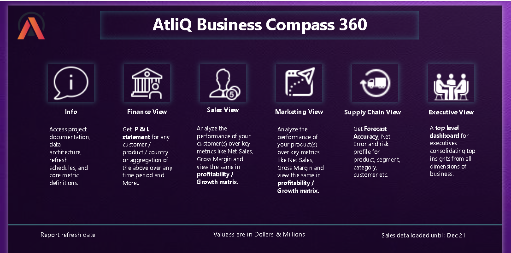
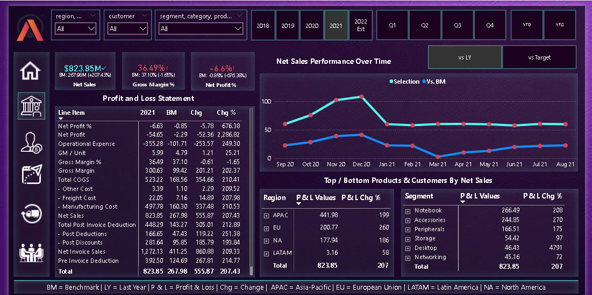
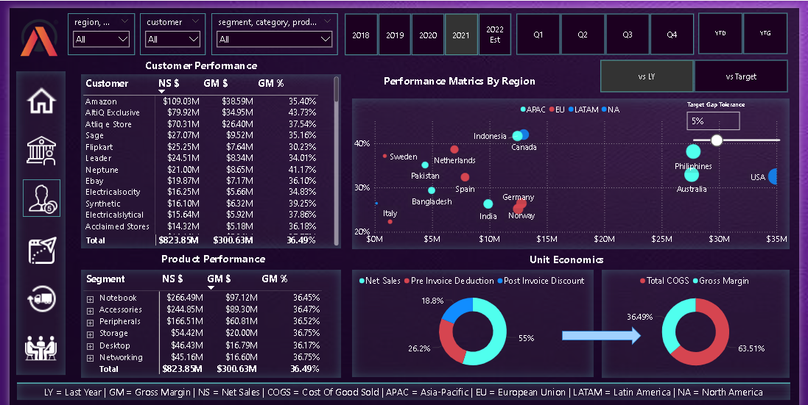
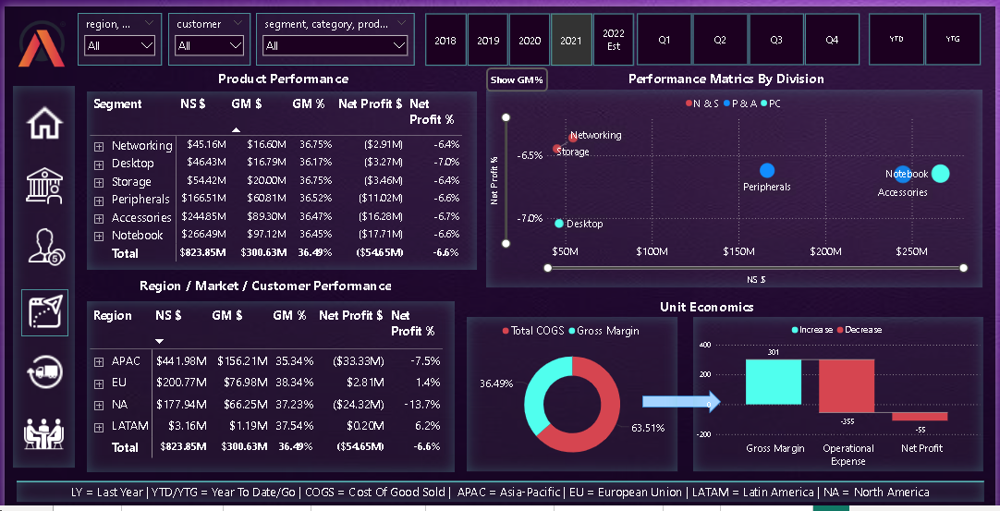
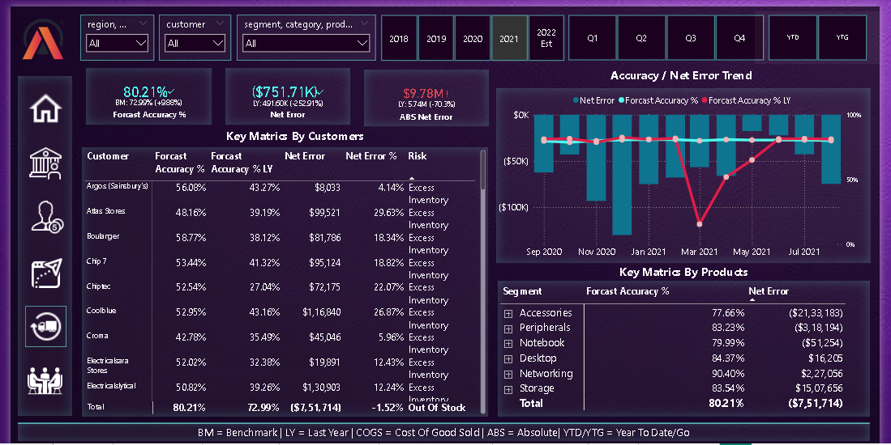
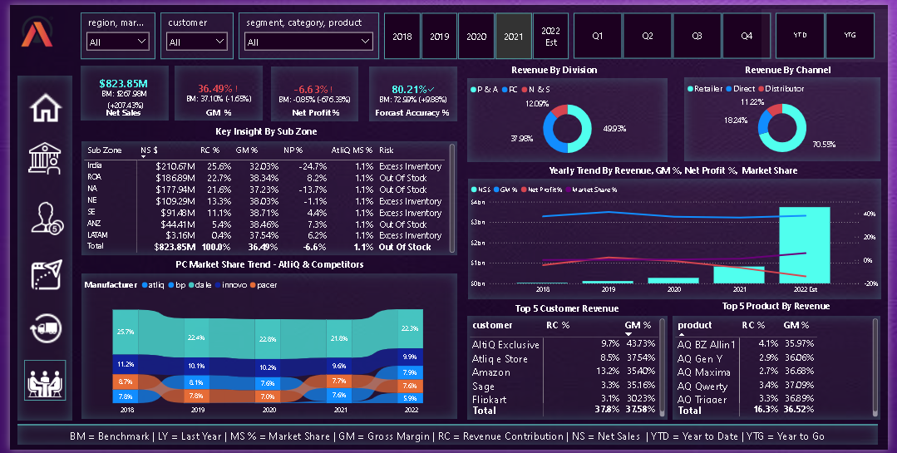
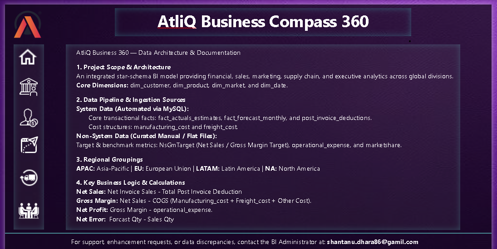
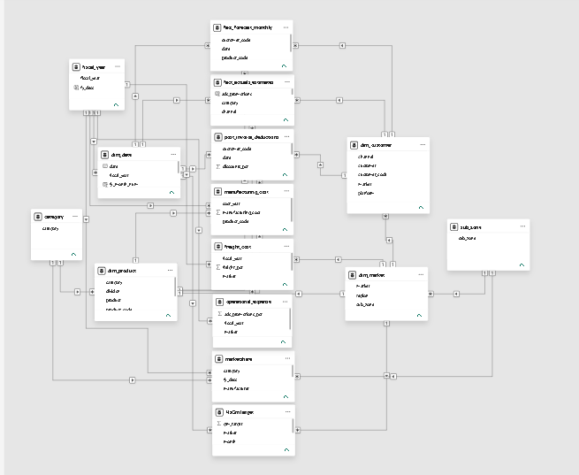

# AtliQ Business Compass 360: From Excel Silos to a Data-Driven Power BI Report

**Power BI · Power Query (M) · DAX · MySQL · Star-Schema Modeling · Business Storytelling**

> An end-to-end Power BI project built on the Codebasics *Business Compass 360* case (guided project), documented as a business analysis: the problem, my approach, and what the data says.

| | |
|---|---|
| **Live dashboard** | [View Live Dashboard](https://app.powerbi.com/view?r=eyJrIjoiYmIxOWQ2NTYtN2I1Ny00ZDA4LWEyNjktOWZmMTY4YjQ2NmY3IiwidCI6ImM2ZTU0OWIzLTVmNDUtNDAzMi1hYWU5LWQ0MjQ0ZGM1YjJjNCJ9&pageName=e973e058f5dadca5abd7) |
| **Read first** | [Key Insights](Documentation/Key_Insights.md) → [Approach](Documentation/Approach.md) → [Business Problem](Documentation/Business_Problem.md) |

---

## The problem in 60 seconds

**AtliQ Hardware** is a fast-growing hardware company with a business model similar to HP or Dell. It sells PCs, mice, keyboards, printers and other peripherals, along with networking and storage products. Its customers are the businesses that buy and resell: brick-and-mortar stores such as Croma, Best Buy and Staples, and online platforms such as Amazon and Flipkart. Its consumers are the end users, people like you and me.

AtliQ sells through three channels:

**Retailer:** partners such as Croma, Best Buy, Amazon and Flipkart.
**Direct:** AtliQ's own AtliQ Exclusive stores and AtliQ e-Store.
**Distributor:** used in markets such as China and South Korea, where selling directly to end consumers isn't possible.

Its attempt to enter Latin America ended in heavy losses because the decisions rested on surveys and intuition. Leadership now wants data-driven decisions. Excel can no longer handle the company's size, and competitors such as Dell operate with large analytics teams.

**My task:** build one trusted Power BI report that lets Finance, Sales, Marketing, Supply Chain and the executive team answer their own questions from a single data model, and use it to find where the business is making or losing money.

---

## What the data says

*Fiscal year runs September to August. FY2021 is the last fully actual year. **FY2022 Est = Sep–Dec 2021 actuals + an 8-month estimate**, so FY2022 findings are hypotheses to test, not results.*

| # | Finding | Evidence | So what |
|---|---|---|---|
| 1 | **Growth is not turning into profit** | Net Sales grew from $29.11M (FY18) to $823.85M (FY21). Net Profit % went from +2.2% (FY19) to −6.6% (FY21). | Scale alone isn't fixing the economics. |
| 2 | **Gross margin is healthy; operating expense is the problem** | FY21 gross margin 36.49% vs OpEx equal to 43.1% of Net Sales, giving a −$54.7M net loss. | Focus on costs below the gross-margin line. |
| 3 | **Only about half of the gross price becomes Net Sales** | FY21: $1,664.6M gross → $823.9M net; $840.8M lost to pre- and post-invoice deductions. | Discount governance is the largest lever visible in the data. |
| 4 | **One market drives the loss** | India: $210.7M Net Sales, −24.7% Net Profit % (about −$52M), roughly 95% of the FY21 company loss. | Targeted audit of India's cost and pricing. |
| 5 | **Margin depends on the customer, not the product** | Segment gross margins sit within 0.6 pts of each other (36.2–36.8%). Customer margins range from 43.7% (AtliQ Exclusive) to 30.2% (Flipkart). | Customer terms, not the product mix, explain margin differences. |


Full evidence, tables and recommendations are in [Key Insights](Documentation/Key_Insights.md).

---

## Dashboard tour

| Page | Question it answers |
|---|---|
| **Home** | Where do I go for what? |
| **Finance** | Where does value leak between Gross Sales and Net Profit? Full P&L for any customer, product or market, vs Last Year or vs Target. |
| **Sales** | Which customers and markets bring revenue *and* margin? |
| **Marketing** | Which products and regions are profitable, not just large? |
| **Supply Chain** | How accurate are forecasts, and where is the risk of excess stock or stock-outs? |
| **Executive** | One-page summary: KPIs, channel and division mix, sub-zone performance, top customers and products, market share. |
| **Info / Support** | Model documentation, metric definitions and contact details. |

Screenshots for every page are in [`/Dashboard`](Dashboard/).

## Home View

## Finance View

## Sales View

## Marketing View

## Supply Chain View 

## Executive View

## Info View



---

## How I built it

```text
MySQL (gdb041) + curated flat files
        ↓  Power Query: fiscal calendar, append actuals + forecast, merge price / deductions / costs
Star-schema data model (facts + dimensions + shared lookups)
        ↓  DAX: layered measures (P&L engine, LY / Target benchmark switch, forecast accuracy)
Six analytical pages + Info
        ↓
Insights → recommendations
```



Details, design decisions and trade-offs: [Approach.md](Documentation/Approach.md).

**Highlights a reviewer may want to probe**

- A custom fiscal calendar (Sep–Aug) built in Power Query.
- One continuous fact table of actuals plus remaining estimates, with a dynamic "last sales month" cut-off.
- A dynamic P&L matrix driven by a 17-row helper table and a single `SWITCH`-based measure.
- A benchmark selector (Last Year vs Target) that blanks targets when the filter grain is finer than the target data.
- Forecast accuracy measured at product × month grain, so over- and under-forecasts don't cancel out.

---

## Skills demonstrated

| Skill | Where to see it |
|---|---|
| Data extraction (MySQL connector) and Power Query (M) | Approach → *Power Query decisions* |
| Dimensional modeling (star schema, shared lookup tables, 24 relationships) | Approach → *Data model* |
| DAX (time intelligence, `SWITCH`, variables, iterators, dynamic titles) | Approach → *DAX layer* |
| Financial analysis (P&L waterfall, variance vs LY and Target) | Key-Insights §1–2 |
| Customer, product and geographic profitability analysis | Key-Insights §3–5 |
| Forecast-accuracy and inventory-risk analysis | Key-Insights §6 |
| Data validation and honest reporting of limitations | Approach → *Validation and limitations* |

---

## Repository structure

```text
AtliQ-Business-Compass-360/
│
├── README.md
│
├── Dashboard/
│   ├── Home.png
│   ├── Finance.png
│   ├── Sales.png
│   ├── Marketing.png
│   ├── Supply_Chain.png
│   ├── Executive.png
│   ├── Info.png
│   └── Data_Model.png
│
├── Documentation/
│   ├── Business_Problem.md
│   ├── Approach.md
│   └── Key_Insights.md
│
├── Resources/
│   ├── Background.jpg
│   ├── Executive.png
│   ├── Finance.png
│   ├── Home.png
│   ├── Info.png
│   ├── Marketing.png
│   ├── Sales.png    
│   └── Supply_Chain.png
│
└── Presentation/ 
    └── AtliQ_Business_Insights_360_Intro.pptx 
```

**Data and PBIX note:** the repository does not include the raw dataset or the `.pbix` file. The raw data may be restricted by the course terms, and the PBIX is large. The repo focuses on the analytical process, dashboard screenshots, documentation and the presentation.

---

## About me

I'm **Shantanu**, an aspiring data analyst and currently a **Management Trainee at Genius HRTech**. I'm completing the **Codebasics Data Analytics Bootcamp** and moving into analytics. This project is where I practised the full BI workflow: SQL-sourced data, modeling, DAX, dashboard design, and turning numbers into recommendations a business could act on.

- LinkedIn: [My Linkedin Profile](https://www.linkedin.com/in/shantanu-dhara/)
- GitHub: [My Github Profile](https://github.com/Shantanu-Dhara/)
- Email: shantanu.dhara86@gamil.com

---

## Acknowledgment

This is a **guided learning project** from the **Codebasics Data Analytics Bootcamp**, based on their *Business Insights 360* case. AtliQ Hardware is a fictitious company and the data is synthetic. Thanks to the Codebasics team and instructors for the case and the structured learning path. This repository is my implementation and portfolio documentation of that project.
